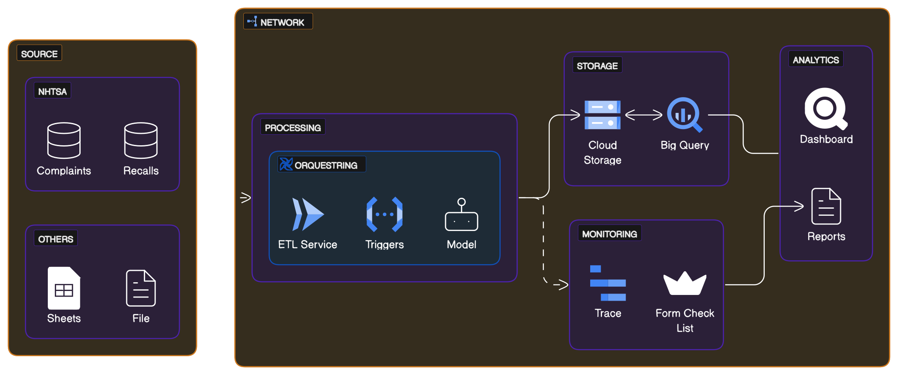

 <h1> <center> NHTSA ETL PIPELINE </center> </h1>

## Table of Content

- [Table of Content](#table-of-content)
- [Anotações de Cria:](#anotações-de-cria)
- [How to run this project](#how-to-run-this-project)
  - [Explanation of the Project Structure](#explanation-of-the-project-structure)
  - [Pipeline Archtecture](#pipeline-archtecture)
  - [Database Feeding](#pipelines-feeding)
  - [Cloud Archtecture:](#cloud-archtecture)
  - [See the Docs](#see-the-docs)

## Anotações de Cria:
1. NHTSA_VOQs: juntar f8 com GRID por model e binning, binnar tudo.
2. Competitive Analysis: filtrar model year 2012 a 2024 e F8, Union all by maker, model year and failure mode (pós processamento) 

## How to run this project

**🚨ATENTION BE ALWAYS ON FORD VPN WHEN STALLING ENV PACKAGES🚨**

1. Install the required dependencies:

```bash
pipenv sync
```
* Asure that Pipfile is on ~/ of the project

2. Activate the enviroment:
```bash
pipenv shell
```

3. Have sure that pre-commit is intalled:

```bash
pre-commit install
```

4. Run the main test of the pipeline that you want.
```bash
pipenv run pytest -s -v src/pipelines/.../main/run.py
```

### Explanation of the Project Structure

<pre>
📦
├─ 📜LICENSE
├─ 📜README.md          <- This file.
├─ ⚙️.gitignore         <- git configuration.
├─ 📂.github            <- GitHub Actions definitions
├─ 📂data
│   ├─ 📂external       <- Data from third party sources.
│   ├─ 📂processed      <- The final, canonical data sets for modeling.
│   └─ 📂raw            <- The original, immutable data dump and system logs.
│
├─ 📂reports            <- Logs, Docs assets and data references.
├─ 📜Pipfile            <- The requirements file.
│
└─ 📂src                <- Source code for use in this project.
</pre>

### Pipeline Archtecture

<pre>
📦src
├─📜README.md           <- The top-level README for developers using this project.
├─⚙️.gitignore          <- git configuration.
│
├─📂errors              <- Errors and Exeptions Definitions.
│  ├─🐍extract_error    <- Errors definitions for extraction step
│  ├─🐍transform_error  <- Errors definitions for Transformation step
│  └─🐍load_error       <- Errors definitions for Loading step
│  
├─📂infra               <- Code Infrastructure (Database management, 3º parties
│                          connections, dataflow visualization, etc).
│
├─📂pipelines           <- Pipeline Control flow.
│  ├─📂contracts        <- Defines contracts for data transmition.
│  │  └─📂schemas       <- Defines schemas for data validation.
│  │
│  ├─ 📂main            <- Pipeline class definition and runner script.
│  │  ├─🐍pipeline      <- Pipeline module
│  │  └─🐍run           <- runs with pytest
│  │
│  ├─ 📂notebooks       <- Jupyter notebooks. Naming convention is a number (for ordering), and
│  │                          a short `-` with a description, ex: `1.0-nhtsa_data_colector.ipynb`.
│  │
│  └─📂stages           <- Definition for each stage and contracts for data transmition.
│     ├─🐍extract       <- Defines Extract Data Step.
│     ├─🐍transform     <- Defines Transform Data Step.
│     └─🐍load          <- Defines Load Data Step.
│
└─📂utils            <- Some helper functions with decorators and loggers.
</pre>

### Pipelines Feeding:
<p>
Our pipelines feeds many databases and here are our processes by order of running:

1. GRID Pipeline is the first to run, it collects some issues to relate latter.
2. NHTSA VOQs is the second, it collects All brands Complaints, ford and not.
3. CompetitiveAnalysis runs on third place to collect all Recalls and relates to collected Complaints.
4. Forty and last is the Warranties pipeline, that collects data from GSAR and RunFMD.
</p>


### Cloud Archtecture:


### Data Models:


### See the Docs

- **<https://app.eraser.io/workspace/my8RA5wATDvoaEuLOffg?origin=share>**