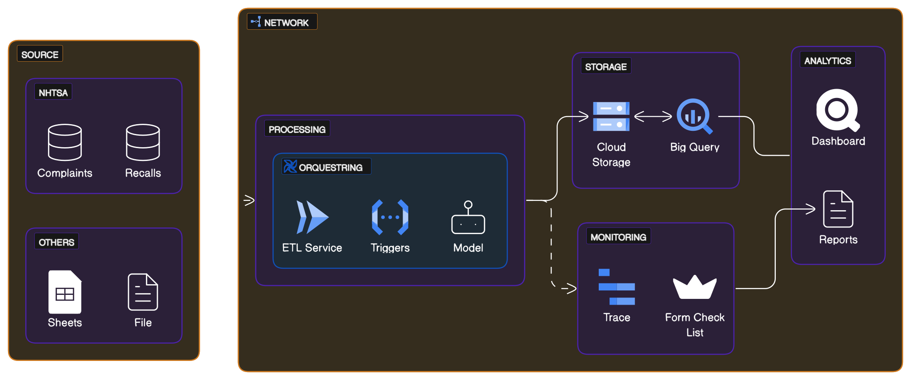

 <h1> <center> NHTSA ETL PIPELINE </center> </h1>

## Table of Content

- [Table of Content](#table-of-content)
- [How to run this project](#how-to-run-this-project)
  - [Explanation of the Project Structure](#explanation-of-the-project-structure)
  - [Pipeline Archtecture](#pipeline-archtecture)
  - [Cloud Archtecture:](#cloud-archtecture)
  - [See the Docs](#see-the-docs)

## How to run this project

**🚨ATENTION BE ALWAYS ON FORD VPN WHEN STALLING ENV PACKAGES🚨**

1. Install the required dependencies:

```bash
conda create --name nhtsa-pipeline --file environment.yml
```

2. Activate the enviroment:
```bash
conda activate nhtsa-pipeline
```

3. Have sure that pre-commit is intalled:

```bash
pre-commit install
```

### Explanation of the Project Structure

<pre>
📦
├─ 📜LICENSE
├─ 📜README.md          <- This file.
├─ ⚙️.gitignore         <- git configuration.
├─ 📂.github            <- GitHub Actions definitions
├─ 📂data
│   ├─ 📂external       <- Data from third party sources.
│   ├─ 📂processed      <- The final, canonical data sets for modeling.
│   ├─ 📂raw            <- The original, immutable data dump and system logs.
│   └─ 📜references.md  <- Data dictionaries, manuals, and all other explanatory materials.
│
├─ 📂frontend           <- Form-Check-List to send after collecting and process data.
│
├─ 📂notebooks          <- Jupyter notebooks. Naming convention is a number (for ordering), and
|   |                       a short `-` with a description, ex: `1.0-nhtsa_data_colector.ipynb`.
│   │
│   └─ 📂scripts        <- Notebooks notebooks turned into scripts, some individual scripts and more
│
├─ 📜environment.yml    <- The requirements file for reproducing the analysis environment, e.g.
│                           generated with `conda list -e > environment.yml`
│
└─ 📂src                <- Source code for use in this project.
</pre>

### Pipeline Archtecture

<pre>
📦src
├─📜README.md           <- The top-level README for developers using this project.
├─⚙️.gitignore          <- git configuration.
├─📂drivers
│  ├─📂interfaces       <- Dependency Inversion.
│  │  ├─🐍structure_df  <- datasets types definitions & save CSV dataset
│  │  └─🐍http_request  <- Request Interface.
│  │
│  ├─🐍structure_df     <- structure of dataset definiton for further add of columns
│  └─🐍http_request     <- Request Inplementation.
│
├─📂errors              <- Errors and Exeptions Definitions.
│  ├─🐍extract_error    <- Errors definitions for extraction step
│  ├─🐍transform_error  <- Errors definitions for Transformation step
│  └─🐍load_error       <- Errors definitions for Loading step
│  
├─📂infra               <- Code Infrastructure (Database management, 3º parties
│  │                       connections, dataflow visualization, etc).
│  └─📂interfaces       <- Dependency Inversion.
│
├─📂main                <- Pipeline Control flow.
│  └─🐍pipeline         <- defines the flow of the ETL process 'run.py'.
│  └─🐍main             <- file alike the common 'run.py'.
│  
└─📂stages              <- Definition for each stage and contracts for data transmition.
   ├─📂contracts        <- Defines contracts for data transmition.
   ├─📂utils            <- Some helper functions with decorators and loggers.
   ├─📂extract          <- Defines Extract Data Step.
   ├─📂transform        <- Defines Transform Data Step.
   └─📂load             <- Defines Load Data Step.
</pre>

### Cloud Archtecture:


### See the Docs

- **<https://app.eraser.io/workspace/my8RA5wATDvoaEuLOffg?origin=share>**
